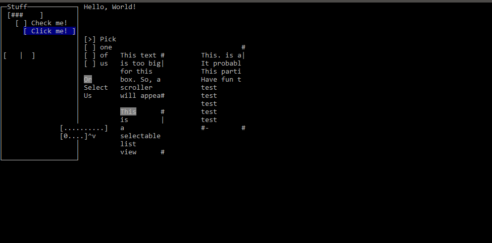

# ConsoleUI.cs v0.8
A simple, extensible Console UI library in C-Sharp.



Controllable using tab, shift+tab, arrow keys, and enter.

## How to Use
You can clone the directory and put the `Source` folder in your project, get it on NuGet or go to releases.

## Example
```csharp
 using Renderer;
 Label s = new Label("Hello, World!");
 Renderer.Render(s, new Vector2(5,5));
```
## Features:
```
Elements
    [x] Label
    [x] ProgressBar
    [X] RadioGroup
    [X] CheckBox
    [X] Panel
    [X] Button
    [x] Input Field
    [X] Int Input Field
    [X] OptionGroup
    [X] TextArea
    [X] ListView
    [X] Image
    [X] Vertical Scrollbar
    [X] Horizontal Scrollbar
    [X] GroupBox
    [X] BigTextBox
    [X] SelectListView
    [ ] TreeView
    [X] Marquee
    [X] Blink
    [X] Horizontal Rule
    [X] Slider
    [ ] Table
    [X] Pixel

Functionality
    [x] Renderer/IRenderable
    [X] Input (tab navigate) IInputable
    [X] ReRender
    [X] Color (use AnsiString instaed of complicating things)
    [X] ConsoleColor -> System.Drawing.Color
    [X] Derive from UIElement
    [X] Animations
    [X] OnHovers
    [X] Placeholders in text boxes
    [ ] TextArea selection (shift+arrows to select, copy/cut/paste)
    [X] TextBox/IntTextBox cursor
    [X] TabIndex
    [ ] HTML like file for layout with names.

[X] Make every property public, rerender on change
[X] Ansi string class. IE new AnsiString("Hello") + " World!".Color(ConsoleColor.Green) + " Bold".Bold();
```
